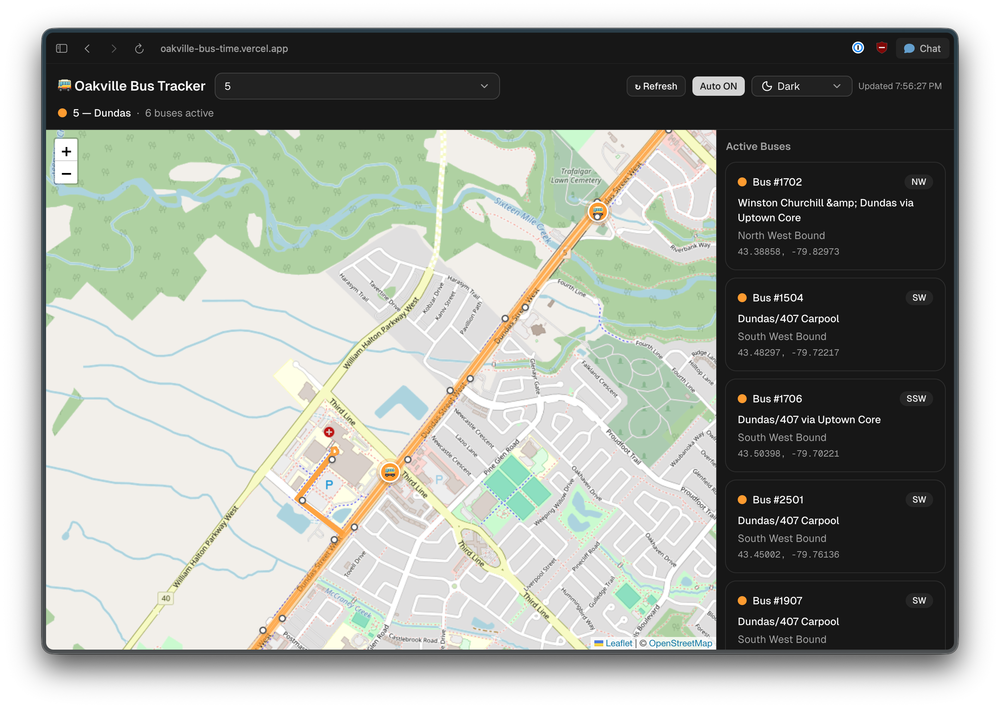

# Oakville Bus Time

Real-time Oakville bus tracking app built with Next.js.

## Live App

https://oakville-bus-time.vercel.app

## Web View

## Features

- Real-time bus positions by route
- Route path overlays on an interactive map
- Active bus list with direction and destination details
- Stop click support for next-bus predictions
- Manual refresh and 30-second auto-refresh toggle
- Responsive layout with light/dark theme toggle

## Notes

- Data freshness depends on Oakville Transit feed update intervals.
- If a route has no active vehicles at a moment, the route can still render while the bus list is empty.
