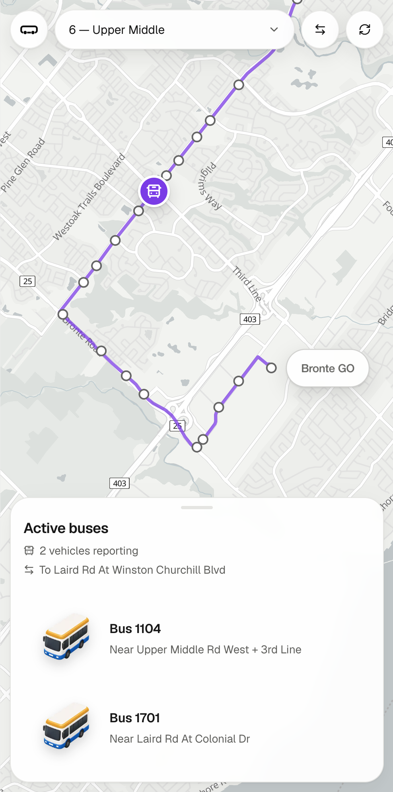

# Oakville Bus Time

Oakville Bus Time is a responsive, real-time map for tracking Oakville Transit
vehicles, routes, stops, and upcoming arrivals.

## Live app

[oakville-bus-time.vercel.app](https://oakville-bus-time.vercel.app)

## Preview

<p align="center">
  
</p>

## Features

- Live vehicle positions and active-vehicle counts for Oakville Transit routes
- Route geometry, stop markers, and origin/destination labels on an interactive map
- Direction switching that filters the route, stops, and active buses together
- Selectable buses with nearby-intersection details and automatic map focus
- Stop selection with upcoming live and scheduled arrival predictions
- Manual vehicle-position refresh
- A draggable Active buses drawer on mobile and a fixed fleet panel on desktop
- System-aware light and dark themes, safe-area support, and mobile web-app metadata

## Getting started

Requirements: Node.js 20+ and npm.

```bash
npm install
npm run dev
```

Open [http://localhost:3000](http://localhost:3000).

Other useful commands:

```bash
npm run lint
npm test
npm run build
```

## Built with

- [Next.js](https://nextjs.org/) and React
- [TypeScript](https://www.typescriptlang.org/)
- [Tailwind CSS](https://tailwindcss.com/)
- [MapLibre GL JS](https://maplibre.org/maplibre-gl-js/docs/) with [OpenFreeMap](https://openfreemap.org/) map styles
- Oakville Transit's BusFinder data for vehicle locations, route geometry, and stop predictions

## Notes

- Live data is fetched through server-side API routes; data freshness depends on
  Oakville Transit's feed update intervals and availability.
- A route can still render when no vehicles are currently reporting.
- This is an independent project and is not an official Oakville Transit app.
